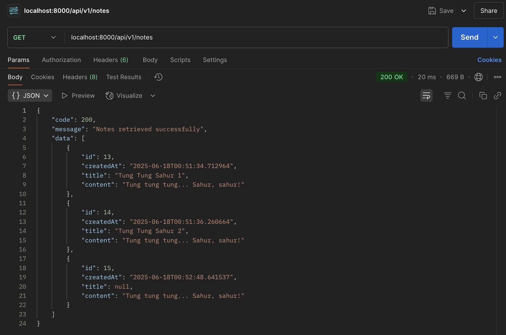
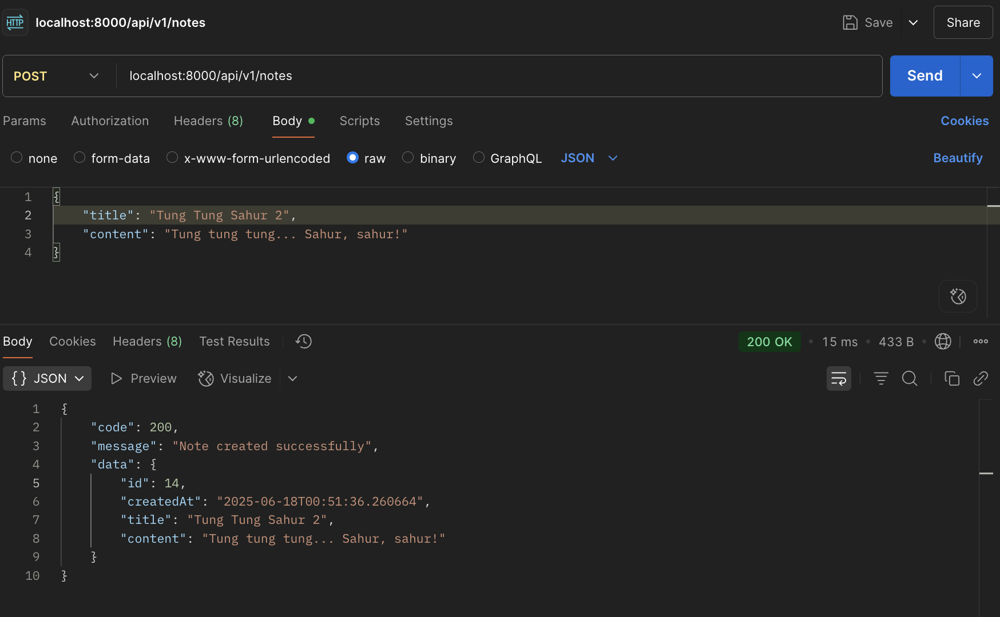
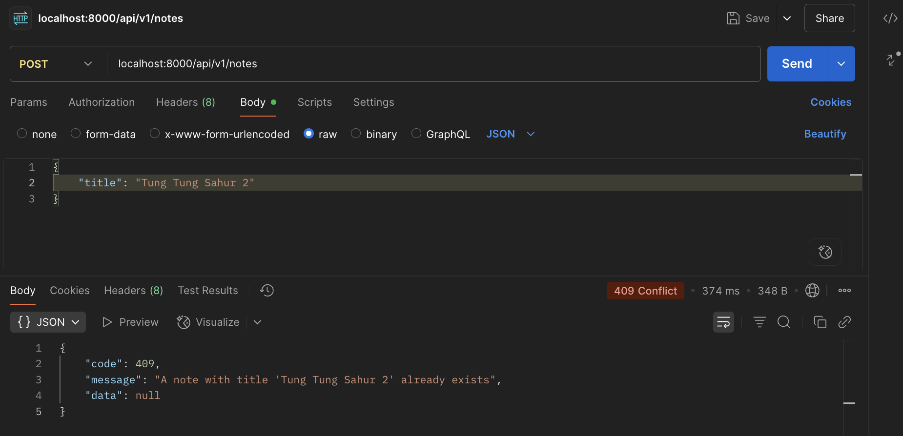
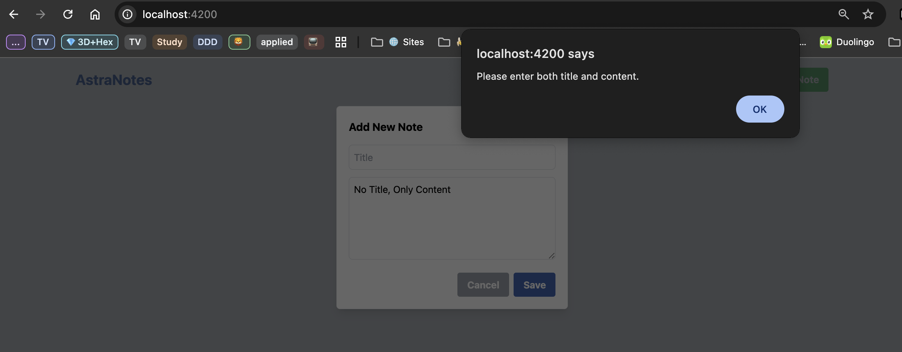
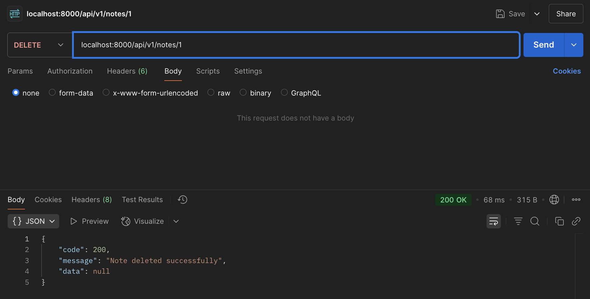
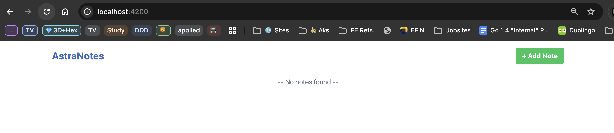
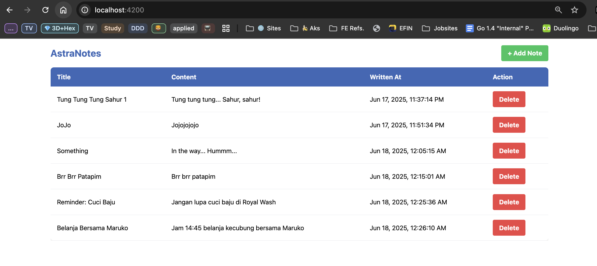

# Spring Boot Astrapay Base Project
Berikut adalah Base Project untuk aplikasi Spring Boot, yang sesuai dengan konvensi yang digunakan pada Astrapay.

#### Author Information:  
- Arthur Purnama
- Anton Rifco Susilo
- JoJo

## How to Run

### Method 1: Using IDE

1. Open the project in your IDE
2. Locate `AstrapayBaseExternal.java` in `src/main/java/com/astrapay/`
3. Right-click on the file and select "Run 'AstrapayBaseExternal'"

### Method 2: Using Maven Command Line

1. Open terminal
2. Navigate to project root directory
3. Run the following command:
   ```bash
   mvn spring-boot:run
   ```

## API Endpoints

### /api/v1/notes [GET]

#### Success



### /api/v1/notes [POST]

#### Success



#### Failed

On attempt to create a new note without any content or title.





### /api/v1/notes/{note_id} [DELETE]

#### Success



## Frontend Screenshots

Source: [Astra Angular Frontend](https://github.com/keyinvoker/astrapay-angular-frontend)

### Empty List



### List Of 6 Notes


